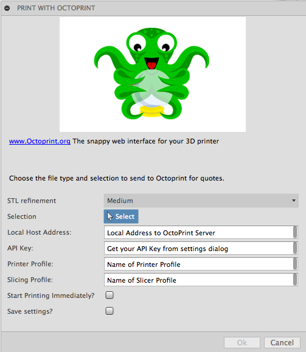

# OctoFusion
OctoPrint Plugin for Fusion 360
Easily push Fusion 360 design to OctoPrint and instantly start printing!

## Usage:
First see [How to install sample Add-Ins and Scripts](https://rawgit.com/AutodeskFusion360/AutodeskFusion360.github.io/master/Installation.html)

See a youtube video of using the script here:
https://youtu.be/_8f63GZO_oM

Basic usage:
  * Open up Octoprint settings
  
  * Get personal API key
  
  * Have you intalled local CURA slicing engine?
  
  * Yes?
  
  * Note the name of printer profile and slicing profile from settings dialog
  
  * Save your personal settings for future use.

## License
Samples are licensed under the terms of the [MIT License](http://opensource.org/licenses/MIT). Please see the [LICENSE](LICENSE) file for full details.

## Written by

Written by Patrick Rainsberry   (Autodesk Fusion 360 Business Development)

